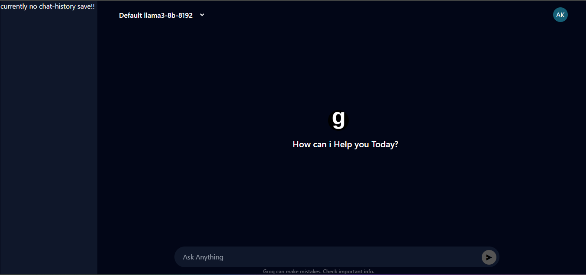

## Dependencies

[](https://expressjs.com/)
[](https://ejs.co/)
[](https://www.npmjs.com/package/express-rate-limit)
[](https://www.npmjs.com/package/groq-sdk)

## CHAT PAGE PREVIEW



## Project Status
## project is currently in the development stage, with more features being added in the future.

# Overview

#### This project is created using the <a href="https://groq.com">Groq</a> API. A big thanks to the Groq team for providing the API for free, making it possible for me to create this project. Without it wouldn't have been feasible for me to pay for API keys.


# Running the Project Locally
#### To run this project on your local system, follow these simple steps:

#### First, go to the <a href="https://console.groq.com/keys">Groq Console</a> and create an API key. If you don't have an account on Groq, you'll need to create one first.


## Installation

1. Clone this repository to your local machine.

```bash
git clone https://github.com/Emmraan/groq.git
```

2. Navigate to the project directory.

```bash
cd  groq
```
3. Install dependencies using npm:

```bash
npm install
```
## Setting Up Environment Variables

```JavaScript
1. Follow these steps to set up your environment variables:

2. Create a new .env file in the root directory of this project.

3. Paste the copied variables from .env.example into the .env file and replace with your own API key.


in .env file

1. GROQ_API_KEY=your_Groq_api_key
2. PORT=3000
```

### To start the development server, run the following command:

```
npm run dev
```
### Server Auto-Restart with Nodemon 🔄
### Accessing the Server On 🌐 http://localhost:3000

<br/>
<br/>
<br/>


# Want to run it in a Docker container?
### Note: Make sure .env file is setup in your root directory before build the docker image, and <a href="https://docker.com">DOCKER</a> installed in your system!

## Build Docker image

```Dockerfile
# Build the app
docker build -t your-app-name .

# Run Docker container for development
docker run -d -p 3000:3000 --env-file .env --name your-container-name your-app-name npm run dev

# Or, run Docker container for production
docker run -d -p 3000:3000 --env-file .env --name your-container-name your-app-name npm run start

# To stop the container
docker stop your-container-name

# To remove the container
docker rm your-container-name

# To remove the image
docker rmi your-image-name
```
### Accessing the Container On 🌐 http://localhost:3000